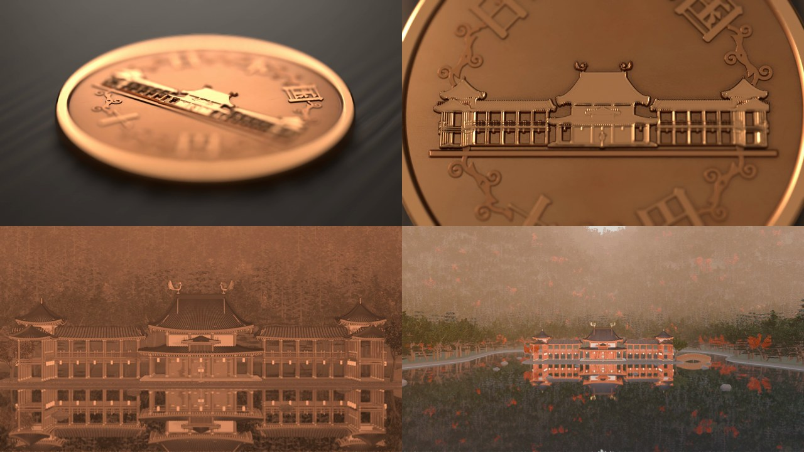
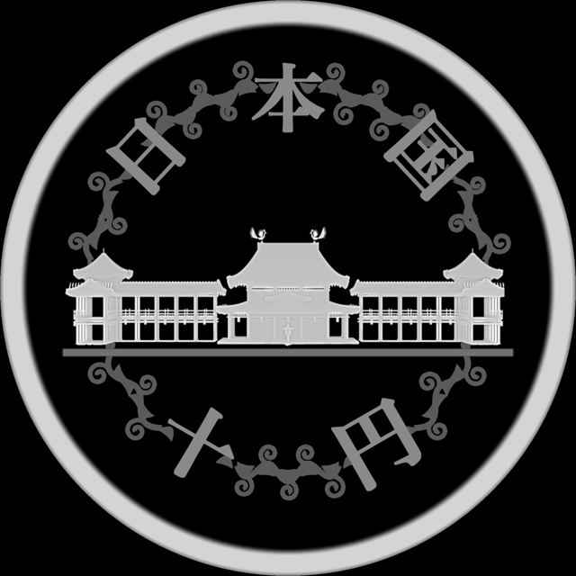
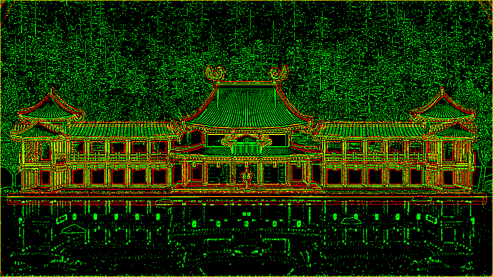

# 10円玉の中の平等院

机の上の 10円玉に寄っていくと、裏の浮き彫りがそのまま本物の平等院鳳凰堂に溶けて、池と森ごと全景まで引いていく 15 秒の動画です。3D モデル・テクスチャ・音の外部素材は使わず、すべて Python のコードで作ります。



10円玉の浮き彫りは手で描いていません。鳳凰堂の 3D モデルを正面から撮った奥行きの画像を浅い浮き彫り（最大 0.24mm）に変えたものです。だから、浮き彫りの 1 本 1 本の柱や屋根の線が、本物の建物のコマとぴったり重なります。

> 実際の 10円玉・平等院の実測ではありません。一般的な外観をもとにした作図です。

鳳凰堂のモデルは [aiimpl/byodoin](https://github.com/aiimpl/byodoin)（CAD 図面から Blender 動画まで）と同じもので、このリポジトリにもそのまま入っています。

## できるもの

| 出力 | 中身 |
|---|---|
| `build/relief_depth.png` | 鳳凰堂を正面の望遠カメラから撮った奥行き（16bit、3840×2160） |
| `build/coin_face.npy` | 10円玉の面の高さ（2048×2048、単位 mm）。縁・浮き彫り・縁に沿った「日本国」「十円」・唐草 |
| `build/coin.blend` | 10円玉のマクロ撮影のシーン（実寸：直径 23.5mm・厚さ 1.5mm） |
| `build/coin_frames/` | 10円玉の 168 コマ |
| `build/bld_frames/` | 本物の鳳凰堂の 216 コマ |
| `build/audio/juuen_mix.wav` | 10円玉を置く音・笙・梵鐘・池の水音・秋の虫（15.2 秒） |
| `build/juuen.mp4` | 完成版（1920×1080・24fps・15.2 秒・音あり） |



## 動作環境

- macOS（Apple M5・メモリ 32GB で確認）
- [Blender](https://www.blender.org/) 5.2（`blender` にパスを通す。4.x では確認していません）
- Python 3.11 以上と `pip install -r requirements.txt`
- ffmpeg

文字には macOS の標準フォント（ヒラギノ明朝など）を使います。ほかの環境では、`BYODOIN_FONT_TITLE`・`BYODOIN_FONT_MINCHO`・`BYODOIN_FONT_SERIF` にフォントファイルのパスを指定してください（`fonts.py`）。

## 使い方

```sh
pip install -r requirements.txt
make all       # 鳳凰堂のシーン → 奥行き画像 → 10円玉の面 → 10円玉のシーン → 音（数分）
make test      # 10円玉と鳳凰堂の要所を半分の解像度で build/test/ に描いて確かめる
make render    # 本番（鳳凰堂 216 コマ＋10円玉 168 コマ）
make video     # build/juuen.mp4
```

`make render` は低い優先度で Blender を動かし、描き終えたコマは飛ばして続きから描きます（`tools/render_juuen.sh`）。M5 の MacBook で約 1 時間でした。

もとの「CAD 図面 → Blender」の 20 秒の動画は `make dxf scroll audio title scene byodoin-render byodoin-video` で作れます。

## しくみ

**浮き彫りはモデルの奥行きから。** `tools/relief_depth.py` が鳳凰堂のシーンを開き、建物だけを、カメラに近いほど白い 16bit の画像にします。池の水と地面は黒で残して手前を隠すので、水面より下の基壇は入りません。`coin/make_face.py` はこれを浮き彫りにします。建物の中だけで明暗を広げ直し、大きな遠近は圧縮して、柱・格子・屋根の段のような細かな段差は強めます（本物の浮き彫りと同じ考え方）。

**つなぎ目はカメラをそろえるだけ。** 奥行き画像を撮るカメラ（`tools/juuen_camera.py`）と、本物の鳳凰堂のショットの最初のコマのカメラは同じです。浮き彫りは 19×10.69mm の 16:9 の矩形にそのまま写し、10円玉のカメラは最後にこの矩形を真上から画面いっぱいに撮ります。だから、2 つのコマを重ねるだけで輪郭が一致します。



**本物の 10円玉に合わせる。** 文字は本物と同じく 1 文字ずつ円周に置いて回し（上は頭を外へ、下は頭を中心へ）、文字のあいだを唐草（波打つ茎・巻きひげ・葉）でつないでいます。色と明るさは、真上から丸ごと撮ったコマ（`coin/check_look.py`）を本物の写真と同じ位置で測って合わせています（地・縁・浮き彫りで 1 割以内）。光は真上の丸い天井から柔らかく回し、横は暗くしています。暗い背景に強い光を当てると、照り返しで全体が白く光ってしまうためです。浮き彫りや文字の脇が黒ずむ汚れは、高さの地図から計算しています（盛り上がりのすぐ脇の低いところほど濃い）。

**青銅の質感。** 高いところ（縁・浮き彫り・文字の上）は触られて明るく磨かれ、くぼみは酸化した暗い色に。3 方向の細いすり傷と指紋のくもりを粗さに入れています（`coin/build_coin.py`）。すり傷は細かすぎると画素と干渉して縞になるので、線の幅を 20μm 前後にしています。

**カメラは一方向。** 10円玉は、机の上の斜めの視点から、真上へ回り込みながら寄っていくだけ。鳳凰堂は、同じ位置から画角を広げながら少し上がっていくだけです。どちらも往復しません。

## ファイル構成

```
coin/                10円玉
  spec.py              寸法（面とシーンで共有）
  make_face.py         面の高さ（縁・浮き彫り・文字・唐草）
  build_coin.py        シーン（青銅・机・光・マクロのカメラ）
  check_look.py        真上から丸ごと 1 枚撮る（本物の写真と色を比べる用）
tools/
  juuen_camera.py      浮き彫りと本物をつなぐカメラ
  relief_depth.py      鳳凰堂の奥行き画像
  building_shot.py     本物の鳳凰堂のショット
  render_juuen.sh      本番レンダー
  test_frames.py       確認用に数コマだけ描く
sound/juuen_audio.py 音
finish/compose_juuen.py  つないで mp4 に（yuv420p）
geometry.py・scene/・cad/・drawing/  鳳凰堂のモデル（aiimpl/byodoin と同じ）
```

## ライセンス

MIT

このリポジトリのコードは [Claude Code](https://claude.com/claude-code)（Claude Opus 5.5）で書きました。
